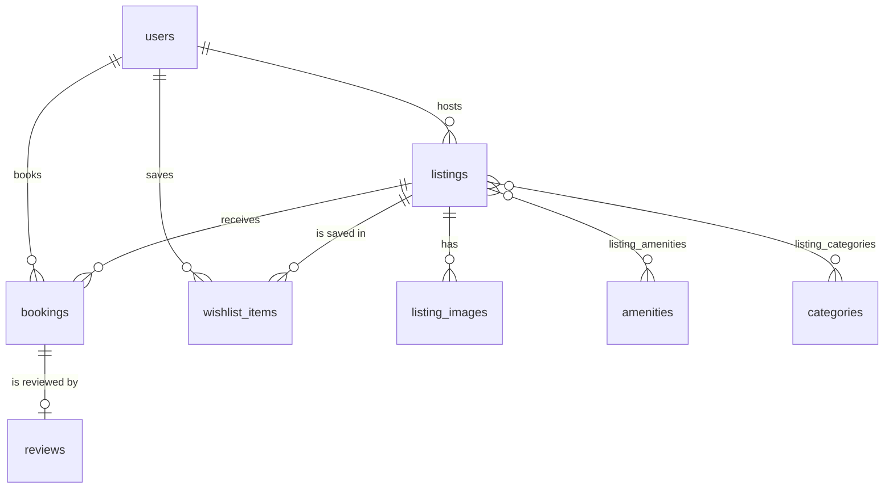

# Airbnb Clone

A full-stack clone of the Airbnb web application. Guests search for stays, examine a listing, and book a date range. Hosts create listings and manage them. Each booking blocks its dates on the listing, so two guests cannot book the same night.

- **Backend:** Python, FastAPI, SQLAlchemy 2 and SQLite (`backend/`)
- **Frontend:** Next.js with TypeScript (`frontend/`)

## Features

### Guests

- Search listings by location, dates and number of guests.
- Filter by price range, type of place, property type, rooms, beds, bathrooms, amenities and category.
- Load results one page at a time for infinite scroll.
- Read a listing: photos, description, amenities, host, booked dates and reviews.
- Get a price quote: nightly rate × nights, cleaning fee and service fee.
- Book a stay. The API rejects past dates, too many guests and dates that another stay uses.
- See all trips in "My Trips". Cancel an upcoming trip to free its dates.
- Write a review after check-out, with an overall rating and six category ratings.
- Save listings to a wishlist.

### Hosts

- Create, edit and delete listings, with photos from a URL or an upload.
- See all owned listings and the number of upcoming reservations on each.
- See all reservations on owned listings, with guest details.

### Simplified features

- Authentication uses email and password with a signed token. There is no email verification.
- Payment is not real. The booking flow records the price and confirms the stay.
- Any user can be a guest and a host. A user becomes a host when they create a listing.

## Architecture

The backend has four layers. Each layer has one responsibility.

| Layer | Folder | Responsibility |
| --- | --- | --- |
| Routers | `app/routers/` | Define the HTTP endpoints. Read the request, call a service, return a schema. |
| Services | `app/services/` | Contain the business rules: search, availability, pricing, booking and review rules. |
| Schemas | `app/schemas/` | Pydantic models. Validate input and define the shape of each response. |
| Models | `app/models/` | SQLAlchemy tables, relationships and database constraints. |

Other modules:

- `app/config.py` reads the settings from environment variables and `.env`.
- `app/security.py` hashes passwords with PBKDF2-SHA256 and signs JWT access tokens.
- `app/deps.py` gives each request a database session and the current user.
- `app/seed.py` and `app/seed_data.py` fill the database with demo data.

### Booking integrity

The API checks availability and inserts the booking in one transaction. SQLite has no row locks. Thus, the service first writes to the listing row. This write takes the database write lock. A second booking request for the same time waits until the first transaction ends. Then it sees the first booking and gets `409 Conflict`.

Two stays overlap when `existing.check_in < new.check_out` and `existing.check_out > new.check_in`. The check-out day is free, so a new guest can arrive on the day the previous guest leaves.

### Price snapshot

A booking stores the nightly rate, the cleaning fee, the service fee and the total at the time of booking. A later price change on the listing does not change existing bookings. The service fee is 14% of the nightly subtotal plus the cleaning fee. You can change this rate in the settings.

## Database schema



| Table | Purpose | Important columns and constraints |
| --- | --- | --- |
| `users` | Guests and hosts | `email` is unique. `password_hash` stores the PBKDF2 hash, iteration count and salt. `is_superhost` controls the badge. |
| `listings` | Places to stay | `host_id` → `users`. `property_type` and `room_type` are enums with CHECK constraints. Prices are whole US dollars. CHECK constraints keep prices, guests and rooms valid. |
| `listing_images` | Ordered photos | `listing_id` → `listings`. `position` sets the display order. |
| `amenities` | Amenity catalogue | `name` is unique. `icon` is a key for the frontend icon. |
| `categories` | Category row on the home page | `slug` is unique. |
| `listing_amenities`, `listing_categories` | Many-to-many links | Composite primary keys prevent duplicate links. |
| `bookings` | Reservations | `listing_id` → `listings`, `guest_id` → `users`. CHECK `check_out > check_in`. `status` is `confirmed` or `cancelled`. An index on `(listing_id, check_in, check_out)` makes the overlap check fast. |
| `reviews` | One review for each stay | `booking_id` is unique and → `bookings`, so a guest can review a stay only once. Seven ratings, each with a CHECK for 1 to 5. |
| `wishlist_items` | Saved listings | Composite primary key `(user_id, listing_id)`. |

Design notes:

- A review links to a booking, not directly to a listing or a user. The listing and the author come from the booking. This design prevents conflicting data, and it lets only real guests write reviews.
- The listing rating and review count are not stored. A correlated subquery calculates them when the API loads a listing card. Thus, the values are always correct.
- All foreign keys use `ON DELETE CASCADE`, and SQLite enforces them with `PRAGMA foreign_keys = ON`. The API does not delete a listing that has upcoming reservations.

## API overview

All endpoints start with `/api`. The server shows interactive documentation at `/docs`. A 🔒 endpoint needs the header `Authorization: Bearer <token>`.

| Area | Endpoints |
| --- | --- |
| Auth | `POST /auth/register`, `POST /auth/login`, `GET /auth/me` 🔒 |
| Catalogue | `GET /categories`, `GET /amenities` |
| Listings | `GET /listings` (search, filters, pagination), `GET /listings/{id}`, `GET /listings/{id}/booked-dates`, `GET /listings/{id}/quote`, `GET /listings/{id}/reviews` |
| Hosting | `POST /listings` 🔒, `PUT /listings/{id}` 🔒, `DELETE /listings/{id}` 🔒, `GET /host/listings` 🔒, `GET /host/bookings` 🔒, `POST /uploads` 🔒 |
| Trips | `POST /bookings` 🔒, `GET /bookings` 🔒, `GET /bookings/{id}` 🔒, `POST /bookings/{id}/cancel` 🔒, `POST /bookings/{id}/review` 🔒 |
| Wishlist | `GET /wishlist` 🔒, `PUT /wishlist/{listing_id}` 🔒, `DELETE /wishlist/{listing_id}` 🔒 |

Error responses use the format `{"detail": "..."}`. The API uses `409 Conflict` for dates that another stay uses, for a duplicate email and for a duplicate review.

## Assumptions

- All prices are whole US dollars. There are no taxes and no currencies other than USD.
- Dates are calendar days with no time zone. "Today" is the server date.
- A stay is 1 to 365 nights for 1 to 16 guests. Infants and pets do not count as guests.
- Only the guest can cancel a booking, and only before the check-in day.
- A guest can review a stay on the check-out day or later.
- Uploaded photos go to the local `uploads/` folder. On a host with temporary storage, use photo URLs instead.
- The seed uses free photos from Unsplash and avatars from pravatar.cc.

## Tests

The backend has API tests for authentication, search filters, pagination, booking rules, overlap rejection, cancellation, reviews, the wishlist, uploads and the seed data.

```bash
cd backend
pytest
```

## Setup

### Backend

1. Go to the backend folder: `cd backend`
2. Create a virtual environment: `python -m venv .venv`
3. Activate it: `source .venv/bin/activate` (on Windows: `.venv\Scripts\activate`)
4. Install the packages: `pip install -r requirements-dev.txt`
5. Copy `.env.example` to `.env`. Set `SECRET_KEY` and `SEED_USER_PASSWORD`.
6. Fill the database with demo data: `python -m app.seed`
7. Start the server: `uvicorn app.main:app --reload`

The API runs at `http://localhost:8000`, and the documentation is at `http://localhost:8000/docs`.

To delete all data and seed again, run `python -m app.seed --reset`.

### Demo accounts

All demo accounts use the password from `SEED_USER_PASSWORD`.

- Guest: `rohan@example.com`
- Host: `aarav@example.com`
