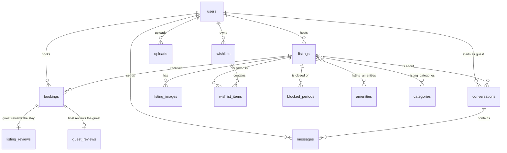

# Airbnb Clone

A full-stack clone of the Airbnb web application for stays in Bengaluru and the nearby weekend getaways. Guests search on a map, examine a listing, book a date range, message the host and review the stay. Hosts create listings with photos, manage reservations and review their guests. Each booking blocks its dates, so two guests cannot book the same night.

- **Backend:** Python, FastAPI, SQLAlchemy 2, Alembic and SQLite (`backend/`)
- **Frontend:** Next.js 16, React 19 and TypeScript, deployed on Cloudflare Workers (`frontend/`)
- **Cloud services:** Google Maps Platform, Google Sign-In and Google Cloud Storage, all inside their free tiers

**Live demo:** https://airbnb.mridulnegi.dev (API: https://airbnb-api.mridulnegi.dev, documentation at `/docs`)

## Features

### Guests

- Search by location, dates and number of guests, or by the visible area of the map.
- Filter by price range, type of place, property type, rooms, beds, bathrooms, amenities and category.
- Load results one page at a time for infinite scroll.
- Read a listing: photos, description, amenities, host, an approximate location, booked dates and reviews.
- Get a price quote: nightly rate × nights, weekly discount, cleaning fee and service fee, in Indian rupees.
- Book a stay. The API rejects past dates, too many guests, stays that are too short or too long, and nights that are booked or blocked.
- See all trips in "My Trips". Cancel an upcoming trip to free its dates. See the exact address after booking.
- Review a stay after check-out, with an overall rating and six category ratings.
- Save listings to named wishlists.
- Message a host about a listing. The inbox shows unread counts.

### Hosts

- Create, edit and remove listings. Add photos by upload or by URL. Find the address with Google Places Autocomplete.
- See all owned listings and the number of upcoming reservations on each.
- Block and unblock nights on the calendar. Set a minimum and a maximum number of nights.
- Give a weekly discount for stays of 7 nights or more.
- See all reservations, with guest details, and review each guest after the stay.

### Profiles

- Each user has a public profile: about, work, languages, home city, verified badge, listings and reviews from guests and hosts.
- Users edit their profile and upload an avatar.
- Users sign in with email and password or with "Continue with Google".

### Simplified features

- Payment is not real. The booking flow records the price and confirms the stay.
- Identity verification is a mock. It marks the user as verified.
- Any user can be a guest and a host.

## Architecture

The backend has four layers. Each layer has one responsibility.

| Layer | Folder | Responsibility |
| --- | --- | --- |
| Routers | `app/routers/` | Define the HTTP endpoints and the rate limits. Read the request, call a service, return a schema. |
| Services | `app/services/` | Contain the business rules: search, availability, pricing, bookings, reviews, wishlists, messages, profiles and images. |
| Schemas | `app/schemas/` | Pydantic models. Validate input and define the shape of each response. |
| Models | `app/models/` | SQLAlchemy tables, relationships and database constraints. |

Other modules:

- `app/config.py` reads the settings from environment variables and `.env`.
- `app/database.py` configures SQLite and the naming convention for constraints. It stores all times in UTC.
- `app/security.py` hashes passwords with PBKDF2-SHA256 and signs JWT access tokens.
- `app/rate_limit.py` limits requests for each client IP and for each user.
- `app/storage.py` saves images to Google Cloud Storage, or to a local folder during development.
- `migrations/` contains the Alembic migrations. The migrations are the source of the database schema.
- `app/seed.py`, `app/seed_content.py` and `app/seed_data.py` fill the database with demo data.

### Frontend

The frontend is a Next.js App Router application. Each route renders a feature component, and each feature component gets its data through React Query.

| Folder | Responsibility |
| --- | --- |
| `src/app/` | Routes: explore (`/`), listing (`/rooms/[id]`), checkout (`/book/[id]`), trips, wishlists, messages, profiles (`/users/[id]`, `/account`), hosting, privacy and terms. |
| `src/components/` | UI grouped by feature: explore, search, listing detail, booking, trips, hosting, wishlists, messages, profiles, maps and shared UI parts. |
| `src/hooks/` | Data hooks for listings, search state, availability, wishlists and unread messages. |
| `src/lib/` | The typed API client (`api.ts`), token storage, formatting, dates, pricing and search parameters. |
| `src/providers/` | Authentication, wishlist and React Query providers. |
| `src/types/` | TypeScript types that match the API contract. |

Other parts:

- **Maps:** `@vis.gl/react-google-maps` with Advanced Markers for price pins. The map and the address search are limited to the service area that the API returns.
- **Sign-in:** Google Identity Services gives an ID token, and the API checks it. The API token is kept in the browser and sent only to the API.
- **Security headers:** `next.config.ts` sets a Content Security Policy, `nosniff`, a referrer policy and a permissions policy for all routes.
- **Images:** `next/image` optimizes photos only from known hosts. Photos from other https hosts load directly in the browser.

### Booking integrity

The API checks availability and inserts the booking in one transaction. SQLite has no row locks. Thus, the service first writes to the listing row. This write takes the database write lock. A second booking request for the same dates waits until the first transaction ends. Then it sees the first booking and gets `409 Conflict`. A host who blocks nights takes the same lock, so a block and a booking cannot both take the same night.

Two stays overlap when `existing.check_in < new.check_out` and `existing.check_out > new.check_in`. The check-out day is free, so a new guest can arrive on the day the previous guest leaves.

### Price snapshot

A booking stores the nightly rate, the discount, the cleaning fee, the service fee and the total at the time of booking. A later price change on the listing does not change existing bookings. For stays of 7 nights or more, the weekly discount is a percentage of the nightly subtotal. The service fee is 14% of the subtotal after the discount, plus the cleaning fee.

### Location privacy

Public listing responses show a map pin that is 150 to 330 m from the real location, in a random direction. A cryptographic random number generator sets the pin when the host saves a new location. The database stores the pin, so nobody can calculate the real location from it, and the pin does not move when the host changes other fields. Map search also uses the pin, so smaller and smaller search areas cannot find the real location. The street address and the exact coordinates are only in the booking response, for the guest and the host.

### Image uploads

The API reads each upload and checks that it is a real JPEG, PNG or WebP image. Then it rotates the image, makes it at most 2048 pixels wide, and saves it again as WebP. This step removes all metadata, such as the GPS location in EXIF data. The file name is random. A listing or an avatar can use an image from our storage only if the same user uploaded it.

## Database schema



| Table | Purpose | Important columns and constraints |
| --- | --- | --- |
| `users` | Guests and hosts | `email` and `google_sub` are unique. CHECK: the user has a password or a Google account. `languages` is a JSON list. |
| `listings` | Places to stay | `host_id` → `users`. Enums with CHECK constraints for the property type and the room type. CHECK constraints keep prices, guests, rooms, coordinates, stay limits (1 to 365 nights) and the weekly discount (0 to 90%) valid. `archived_at` marks a removed listing. |
| `listing_images` | Ordered photos | `listing_id` → `listings`. `position` sets the display order. |
| `blocked_periods` | Nights that the host closed | CHECK `end_date > start_date`. Index on `(listing_id, start_date, end_date)`. |
| `amenities`, `categories` | Catalogues | `name` and `slug` are unique. `icon` is a key for the frontend icon. |
| `listing_amenities`, `listing_categories` | Many-to-many links | Composite primary keys prevent duplicate links. |
| `bookings` | Reservations | CHECK `check_out > check_in`. `status` is `confirmed` or `cancelled`. CHECK: `cancelled_at` is set only for a cancelled booking. Index on `(listing_id, check_in, check_out)` for the overlap check. |
| `listing_reviews` | The guest's review of a stay | `booking_id` is unique, so there is one review for each stay. Seven ratings, each with a CHECK for 1 to 5. |
| `guest_reviews` | The host's review of a guest | `booking_id` is unique. One rating with a CHECK for 1 to 5. |
| `wishlists`, `wishlist_items` | Named wishlists | The name is unique for each user. Composite primary key `(wishlist_id, listing_id)`. |
| `conversations`, `messages` | Guest and host messages | One conversation for each listing and guest. Each participant stores the ID of the last message they read. Message IDs only increase (`AUTOINCREMENT`). |
| `uploads` | Images that a user uploaded | `storage_key` and `url` are unique. Size and dimensions have CHECK constraints. |

### Delete rules

Each foreign key has a delete rule that matches the meaning of the data. SQLite enforces the rules because the API sets `PRAGMA foreign_keys = ON` on each connection.

| Rule | Where | Reason |
| --- | --- | --- |
| `RESTRICT` | Bookings → listings and users. Reviews → bookings. Conversations and messages → users and listings. Listings → host. | Bookings and reviews are financial and history records. The database refuses to delete a row that a booking or a review uses. |
| `CASCADE` | Images, blocked periods, amenity links and category links → listings. Wishlist items → wishlists. Wishlists and uploads → users. Messages → conversations. | These rows belong to their parent and have no meaning without it. |
| Soft delete | Listings | "Delete" sets `archived_at`. The listing leaves search, but past trips and reviews still show it. The API refuses to archive a listing that has upcoming reservations. |

### Other design decisions

- A review links to a booking, not directly to a listing or a user. The listing and the author come from the booking. Thus, only real guests and real hosts can write reviews, and the data cannot conflict.
- The listing rating and review count are not stored. A correlated subquery calculates them when the API loads a listing. Thus, the values are always correct.
- A partial index on the coordinates of active listings makes the map search fast.
- Money is a whole number of rupees (`INTEGER`), so there are no rounding errors.
- The naming convention gives every constraint a fixed name, so Alembic can change constraints on SQLite.
- Alembic autogenerate does not compare CHECK constraints. Thus, a test compares the CHECK constraints of a migrated database with those of a database made from the models.

## API overview

All endpoints start with `/api`. The server shows interactive documentation at `/docs`. A 🔒 endpoint needs the header `Authorization: Bearer <token>`.

| Area | Endpoints |
| --- | --- |
| Auth | `POST /auth/register`, `POST /auth/login`, `POST /auth/google`, `GET /auth/me` 🔒 |
| Catalogue | `GET /categories`, `GET /amenities`, `GET /service-area` |
| Listings | `GET /listings` (search, filters, map bounds, pagination), `GET /listings/{id}`, `GET /listings/{id}/booked-dates`, `GET /listings/{id}/quote`, `GET /listings/{id}/reviews` |
| Hosting | `POST /listings` 🔒, `PUT /listings/{id}` 🔒, `DELETE /listings/{id}` 🔒, `GET /host/listings` 🔒, `GET /host/listings/{id}` 🔒, `GET` and `POST /host/listings/{id}/blocked-dates` 🔒, `DELETE /host/listings/{id}/blocked-dates/{period_id}` 🔒, `GET /host/bookings` 🔒, `POST /uploads` 🔒 |
| Trips | `POST /bookings` 🔒, `GET /bookings` 🔒, `GET /bookings/{id}` 🔒, `POST /bookings/{id}/cancel` 🔒, `POST /bookings/{id}/review` 🔒, `POST /bookings/{id}/guest-review` 🔒 |
| Wishlists | `GET /wishlists` 🔒, `POST /wishlists` 🔒, `GET /wishlists/saved` 🔒, `GET`, `PATCH` and `DELETE /wishlists/{id}` 🔒, `PUT` and `DELETE /wishlists/{id}/listings/{listing_id}` 🔒 |
| Profiles | `GET /users/{id}`, `GET /users/{id}/listings`, `GET /users/{id}/reviews`, `PATCH /users/me` 🔒, `POST /users/me/identity-verification` 🔒 |
| Messages | `GET /conversations` 🔒, `POST /conversations` 🔒, `GET /conversations/unread-count` 🔒, `GET` and `POST /conversations/{id}/messages` 🔒, `POST /conversations/{id}/read` 🔒 |

Error responses use the format `{"detail": "..."}`. The API uses `409 Conflict` for dates that another stay uses, for a duplicate email, for a duplicate review and for a duplicate wishlist name. It uses `429 Too Many Requests` with a `Retry-After` header when a client goes over a limit.

## Security and limits

- **Passwords:** PBKDF2-SHA256 with 600,000 iterations and a random salt. Login takes the same time for unknown emails.
- **Sessions:** each access token holds a version number. When Google sign-in takes over an account that someone registered with the same email, the API removes the password and increases the version. This action signs out all old sessions.
- **Google sign-in:** the API checks the signature of the Google ID token with Google's public keys. It also checks the audience, the issuer, the expiry time and that Google verified the email. The API links Google to an existing account only for Gmail and Google Workspace addresses, because Google confirms the owner of these addresses.
- **Request limits for each client IP:** 300 requests a minute in total, and 20 login and sign-up attempts in 5 minutes.
- **Limits for each user:** 10 bookings an hour, 30 messages a minute, 10 new conversations an hour, 60 uploads an hour (300 in total), 20 reviews an hour, 30 listing changes an hour and 60 calendar changes an hour.
- **Memory:** each limiter keeps at most 50,000 clients. When it is full, it forgets the client that it saw least recently. IPv6 clients count as one /64 network. Transition addresses (Teredo, 6to4, NAT64) count as the IPv4 client inside them.
- **Uploads:** at most 8 MB and 16 megapixels. The API rejects a larger `Content-Length` before it reads the body, and it rejects larger image dimensions before it decodes the pixels. It processes one image at a time to keep memory use low.
- **Google Cloud:** each Maps and Places API has a daily quota cap below the free tier. A budget alert sends an email at ₹1. The browser API key works only from the app domains.
- **Validation:** each ID, number and text field has a range or a maximum length. Errors never return the rejected input.

## Assumptions

- All prices are whole Indian rupees. There are no taxes.
- The service area is Bengaluru and the getaways within about 250 km. The API rejects listings outside this area.
- Dates are calendar days with no time zone. "Today" is the server date.
- A stay is 1 to 365 nights for 1 to 16 guests. Infants and pets do not count as guests.
- Only the guest can cancel a booking, and only before the check-in day.
- Payment is mocked. Thus, any user can book a stay to see the exact address and then cancel. A real payment step would prevent this.
- Reviews open on the check-out day.
- The rate limits are in process memory. Thus, the API runs as one process.
- The seed uses free photos from Unsplash and avatars from pravatar.cc. All names and addresses are fictional.

## Tests

The backend has three kinds of tests:

- **API tests** for each feature, with unit tests for pricing and the rate limiter.
- **Security tests** (`tests/test_security.py`): forged and expired tokens, access to the data of other users, mass assignment, SQL and wildcard injection, dangerous uploads, path traversal, data leaks, location privacy, CORS and rate limits.
- **Migration tests:** the migrations create the same schema and CHECK constraints as the models, and they downgrade cleanly.

```bash
cd backend
pytest
```

A smoke test checks a running server from end to end. Without `--write`, it only reads data. With `--write`, it signs up a new user and tries the main guest and host flows.

```bash
python scripts/smoke_test.py --base-url http://localhost:8000 --write
```

## Setup

### Backend

1. Go to the backend folder: `cd backend`
2. Create a virtual environment: `python -m venv .venv`
3. Activate it: `source .venv/bin/activate` (on Windows: `.venv\Scripts\activate`)
4. Install the packages: `pip install -r requirements-dev.txt`
5. Copy `.env.example` to `.env`. Set `SECRET_KEY` and `SEED_USER_PASSWORD`.
6. Run the migrations and add the demo data: `python -m app.seed`
7. Start the server: `uvicorn app.main:app --reload`

The API runs at `http://localhost:8000`, and the documentation is at `http://localhost:8000/docs`. To delete all data and seed again, run `python -m app.seed --reset`.

### Frontend

1. Go to the frontend folder: `cd frontend`
2. Install the packages: `npm install`
3. Copy `.env.example` to `.env.local`, and set the values:
   - `NEXT_PUBLIC_API_URL`: the API address, for example `http://localhost:8000`
   - `NEXT_PUBLIC_GOOGLE_MAPS_API_KEY` and `NEXT_PUBLIC_GOOGLE_MAPS_MAP_ID`: a Maps browser key and a Map ID
   - `NEXT_PUBLIC_GOOGLE_CLIENT_ID`: the OAuth web client ID for Google sign-in
   - `NEXT_PUBLIC_CONTACT_EMAIL`: the contact address on the privacy page
4. Start the development server: `npm run dev`

The site runs at `http://localhost:3000`. To check the code, run `npm run lint` and `npm run typecheck`.

To deploy the site to Cloudflare Workers, run `npm run deploy`. The OpenNext adapter builds the site, and Wrangler uploads it. `wrangler.jsonc` sets the custom domain.

### Backend deployment

The API runs in Docker on a Linux server. Cloudflare proxies the traffic to Caddy, and Caddy proxies it to the API.

1. Make the archive on your computer: `python deploy/package_backend.py --output ../airbnb-backend.tar.gz`
2. Copy the archive to the server and extract it, for example into `/opt/airbnb-clone/backend`.
3. Copy `deploy/oracle-api.env.example` to `.env` on the server, set the values, and run `chmod 600 .env`.
4. Create the data folder for the container user: `mkdir -p data && sudo chown 10001 data`
5. Start the API with one of these commands:
   - Photos on the server disk: `docker compose up -d --build`
   - Photos in Google Cloud Storage: put the service-account key in `secrets/gcs-service-account.json` (owner `10001`, mode `600`), then run `docker compose -f compose.yaml -f compose.gcs.yaml up -d --build`
6. Add the site to the Caddyfile and reload Caddy. The global options make Caddy trust Cloudflare and read the visitor address from `CF-Connecting-IP`. Without them, the rate limits count Cloudflare servers instead of visitors.

```
{
    servers {
        trusted_proxies static <Cloudflare IP ranges from https://www.cloudflare.com/ips/>
        client_ip_headers CF-Connecting-IP
    }
}

airbnb-api.example.com {
    request_body {
        max_size 10MB
    }
    reverse_proxy 127.0.0.1:8002 {
        header_up X-Forwarded-For {client_ip}
    }
}
```

7. Run a nightly backup with cron or a systemd timer: `docker exec airbnb-api python -m app.backup`. It keeps the last 7 days.

The container runs as a user without privileges, with a read-only file system and limits on memory and CPU. When it starts, it runs the migrations. It adds the demo data only if the database is empty.

### Demo accounts

Use these two accounts to try the live demo. The password for both accounts is `demo-I2vAZFI_IUaj`. The demo seed sets this password from `SEED_USER_PASSWORD`. The other seeded accounts get a random password that nobody knows.

- Guest: `rohan@example.com`
- Host: `kavya@example.com`
